<div align="center">

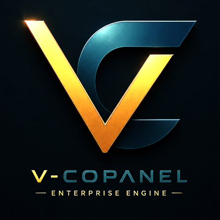

<h1>V-CoPanel Windows</h1>

<p><b>The Ultimate Zero-Dependency, Portable Local Development Environment for Windows</b></p>

<p><i>Engineered & Designed by <b><a href="https://vjects.com">VJECTS</a></b> — Digital Reality Engineering</i></p>

<br>

[](https://github.com/vjects/V-CoPanel-Windows/releases)
[](https://go.dev)
[](https://github.com/vjects/V-CoPanel-Windows/releases)
[](LICENSE)
[](https://github.com/vjects/V-CoPanel-Windows)

<br>

</div>

---

> [!IMPORTANT]
> **End-Users: Not much difference in releases.**
>
> We have 2 releases... one full bundle and the other without pc-assets... You know the difference 🤭
>
> ✅ **To run V-CoPanel:** Download the fully bundled, plug-and-play release package from the **[→ GitHub Releases](https://github.com/vjects/V-CoPanel-Windows/releases)** page. Extract the ZIP and double-click `start.bat`. That's it.

---

<div align="center">

*No Docker. No WSL. No global installations. No registry pollution.*
*Just extract, double-click, and code.*

**[📖 Full Documentation](docs/V-CoPanel-Comprehensive-Guide.md)** &nbsp;•&nbsp; **[🐛 Report a Bug](https://github.com/vjects/V-CoPanel-Windows/issues)** &nbsp;•&nbsp; **[💬 Telegram Support](https://t.me/vjects)**

</div>

---

## 📸 Screenshots (V.1.0.0)

<details>
  <summary><b>🖼️ Click to view all 13 screenshots</b></summary>
  <br>

  | | | |
  |:---:|:---:|:---:|
  | 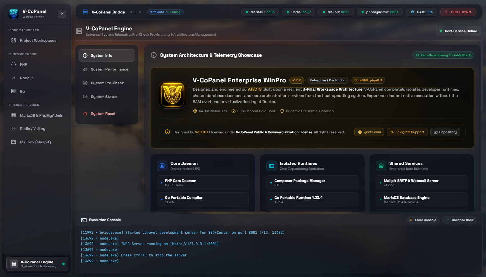<br><sub><b>00 · Main Dashboard</b></sub> | 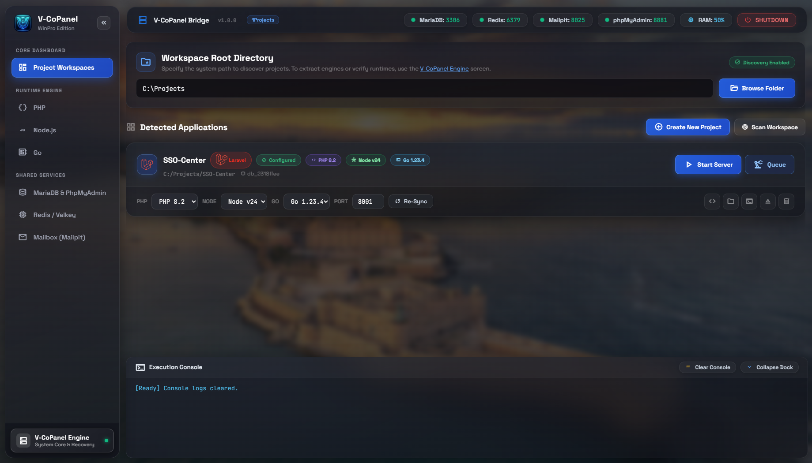<br><sub><b>01 · Project Manager</b></sub> | 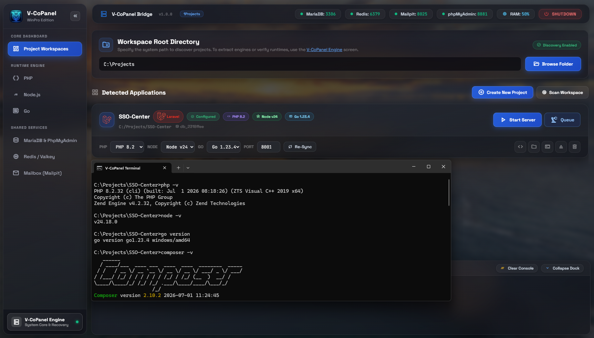<br><sub><b>02 · Runtime Configuration</b></sub> |
  | 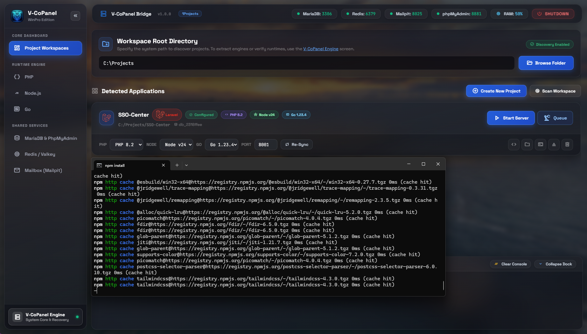<br><sub><b>03 · Live Telemetry</b></sub> | 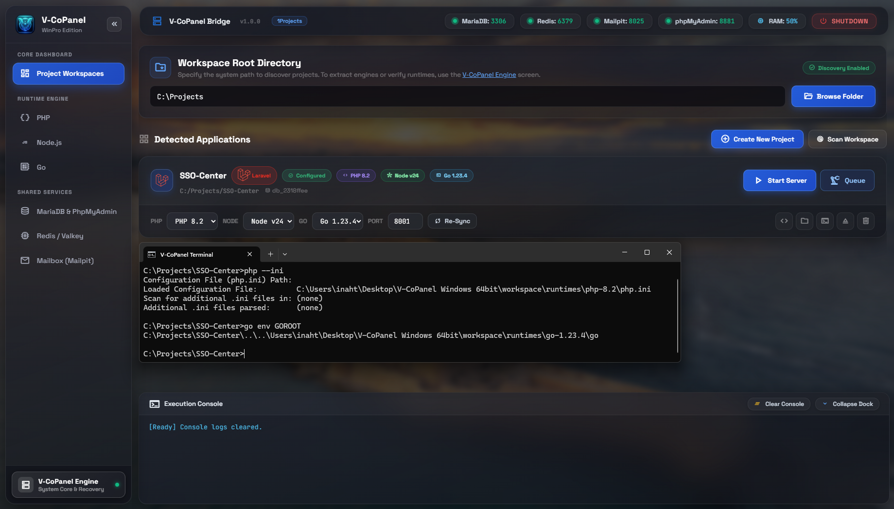<br><sub><b>04 · Performance Matrix</b></sub> | 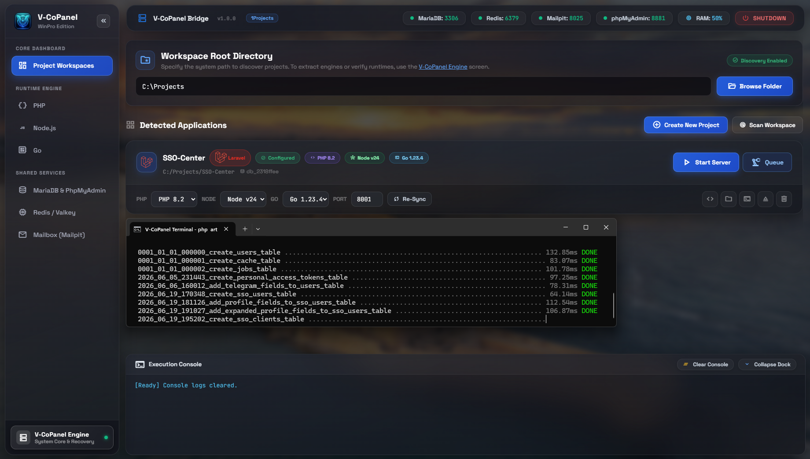<br><sub><b>05 · MariaDB Service</b></sub> |
  | 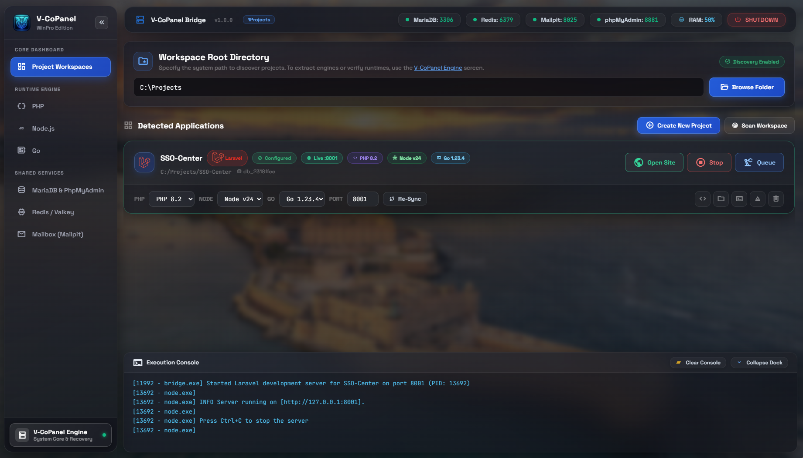<br><sub><b>06 · Redis Cache Layer</b></sub> | 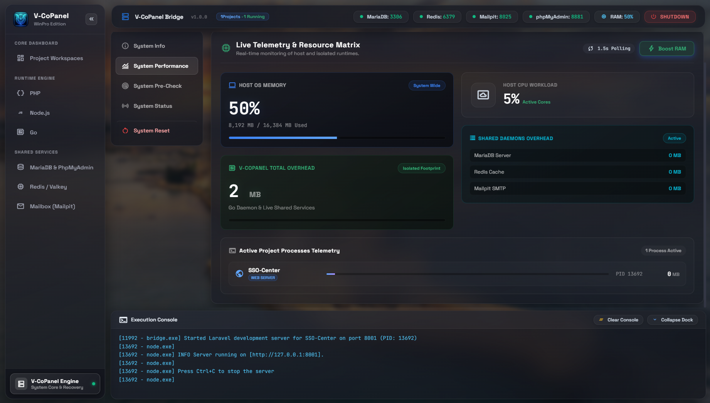<br><sub><b>07 · phpMyAdmin Interface</b></sub> | 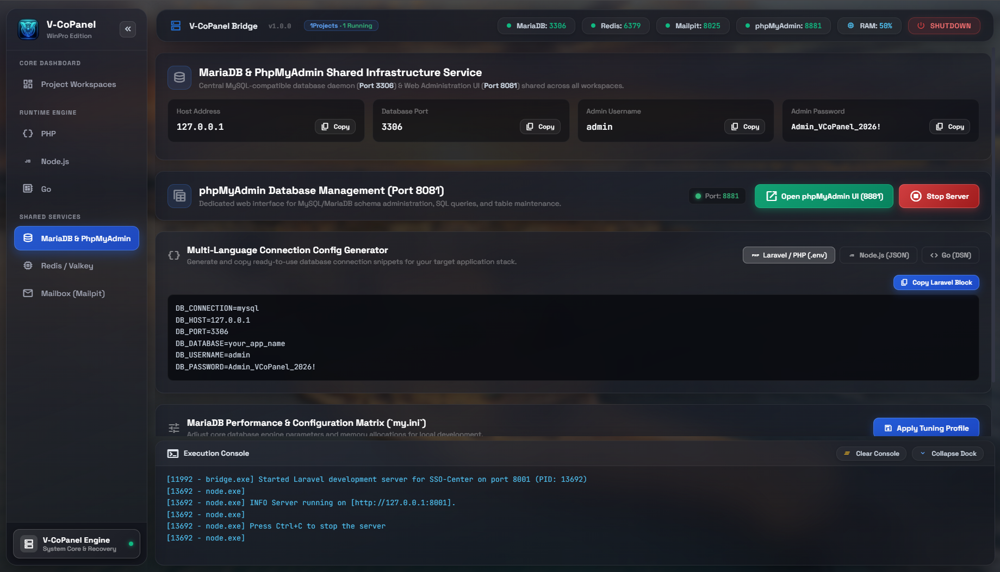<br><sub><b>08 · Mailpit Inbox</b></sub> |
  | 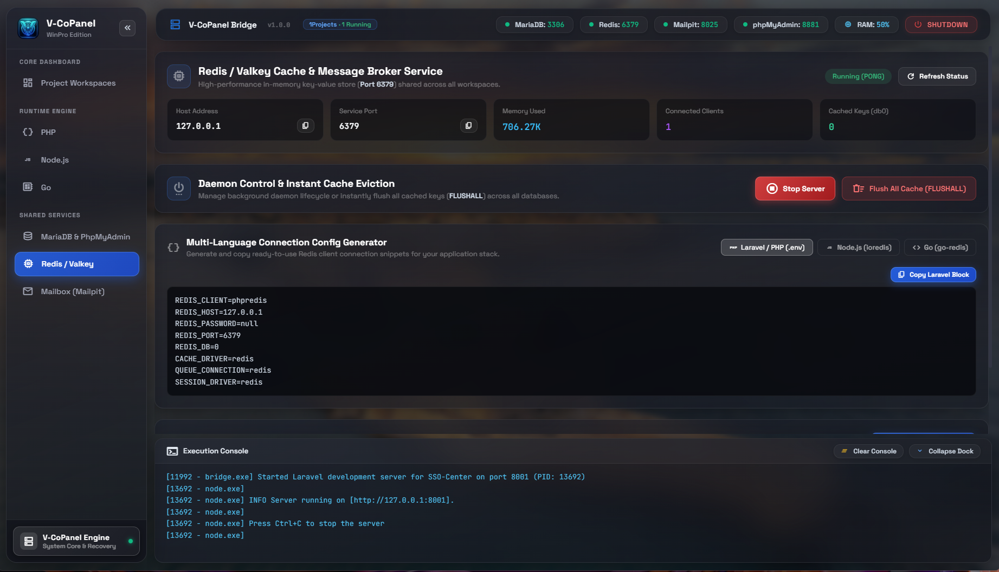<br><sub><b>09 · Project Provisioning</b></sub> | 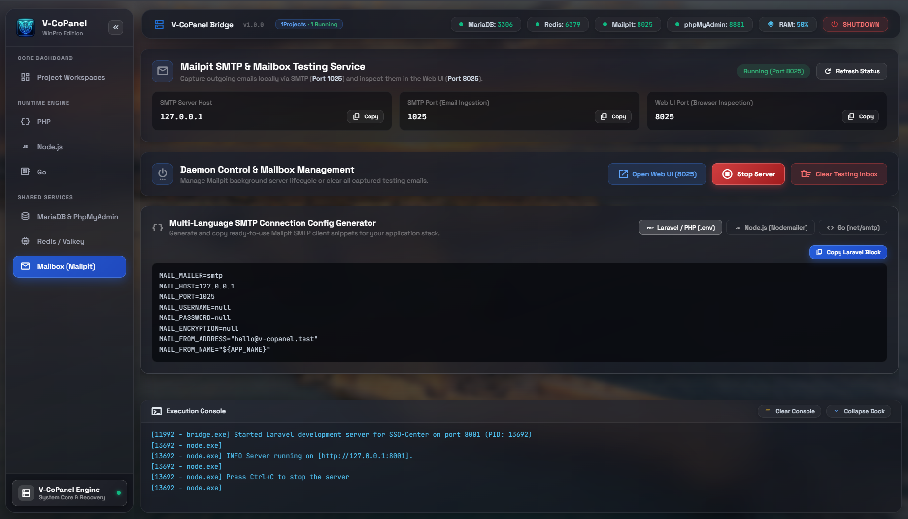<br><sub><b>10 · System Pre-Check</b></sub> | 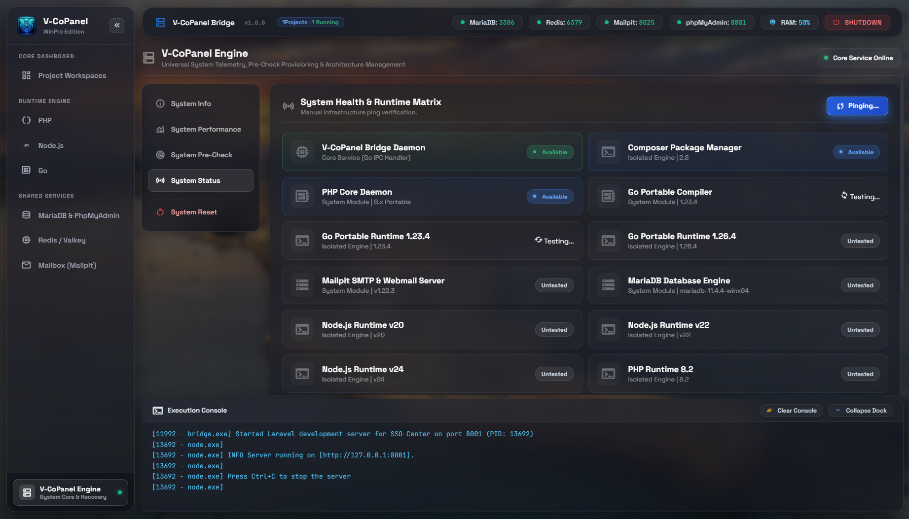<br><sub><b>11 · Reset Engine</b></sub> |
  | 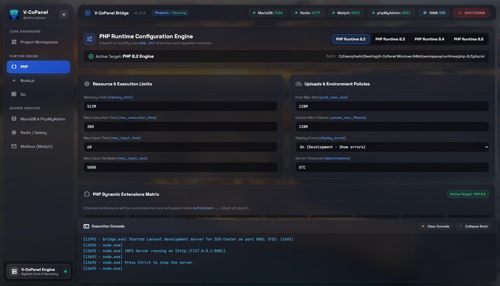<br><sub><b>12 · Desktop Integration</b></sub> | | |

  <br>
</details>

---

## 🧠 Why V-CoPanel Exists

> I'm a Linux developer who was forced to work on Windows for a project. What followed was a masterclass in absurdity.

PHP versions colliding in system variables. Port conflicts appearing from nowhere. Queue workers crashing silently in the background. So I did what any sane developer would do — I asked the AI assistants.

They answered enthusiastically: **"Just use Docker, Herd, or Laragon!"**

Here's what actually happened:

| Tool | The Reality |
|------|-------------|
| 🐳 **Docker + WSL2** | 80-character commands to run `php artisan migrate`. 16GB RAM consumed by three empty containers. |
| 🐄 **Laravel Herd** | Beautiful UI — until every useful feature hits a paywall with annual subscription fees. |
| 🦎 **Laragon** | A time capsule. UI design frozen circa Windows XP 2008. |

After staring at my frozen screen, I built my own solution. **V-CoPanel** was born — a 5MB Go binary that manages isolated, multi-version microservices effortlessly, no nonsense.

> *"I didn't build V-CoPanel because I love Windows. From me — a die-hard Linux user — to the entire Windows community: **YOU'RE WELCOME.**"*
> — Founder, VJECTS

---

## ⚡ Feature Overview

### 🏗️ True Project Isolation
Each project lives in its own bubble. No shared globals, no version conflicts, no surprises.
- Run **unlimited projects simultaneously** on auto-assigned sequential ports
- **Per-project runtime selection:** Project A on PHP 8.4 + Node v24, Project B on PHP 8.2 + Node v20 — side by side
- **Zero system footprint:** Nothing written to the Windows Registry or system `PATH`

### 🔌 Intelligent Shims Engine
- Auto-generates `php.bat`, `npm.cmd`, `go.bat`, `composer.bat` inside each project root
- Typing `php artisan serve` in your terminal routes through V-CoPanel's isolated runtime — not the OS
- **Sandbox Block injection:** Database, Redis, and Mailpit credentials auto-injected into `.env`, protected by clear boundary markers

### 🗄️ Embedded Enterprise Services

| Service | Port | Description |
|---------|------|-------------|
| **MariaDB** | `3306` | Enterprise-grade relational DB, drop-in MySQL replacement |
| **Redis** | `6379` | In-memory cache for sessions, queues, and general caching |
| **phpMyAdmin** | `8881` | Full-featured web-based DB management UI |
| **Mailpit** | `8025` / `3025` | Local SMTP catcher & webmail UI for email testing |

### 🔄 Clean Project Ejection
**No vendor lock-in.** Click Eject and V-CoPanel:
1. Drops the project database from MariaDB
2. Removes the Sandbox Block from `.env`
3. Deletes all shim files from the project root
4. Unregisters the project internally

Your source code is restored to its exact, pristine original state.

### 📡 Offline-First Architecture
All runtimes (PHP, Node.js, MariaDB, Redis, Mailpit, phpMyAdmin) are shipped as pre-packaged `.zip` archives inside `pc-assets/`. The engine **never makes an internet request** to function. This means:
- ✅ Works behind strict corporate firewalls
- ✅ Boots in under 5 seconds (SSD extraction speeds)
- ✅ Guaranteed version consistency across your entire team
- ✅ Will work exactly the same way 10 years from now

---

## 🚀 Quick Start

```
1. Download the latest release from GitHub Releases
2. Extract the ZIP to any directory
3. Double-click start.bat
4. Open http://localhost:8880 in your browser
```

**That's the entire setup. Zero configuration required.**

---

> [!NOTE]
> **Security-Conscious Developers:** Suspicious of the pre-packaged `pc-assets/` archives? Totally fair. Download the exact same versions directly from the official vendor sites (`php.net`, `nodejs.org`, `mariadb.org`) and drop them into the appropriate `pc-assets/` subdirectories using the filenames listed in `pc-assets/README.md`. The engine will use your verified copies. ☕

---

## 🏛️ Supported Stack

| Category | Technologies |
|----------|-------------|
| PHP | 8.2 · 8.3 · 8.4 · 8.5 |
| Node.js | v20 LTS · v22 LTS · v24 LTS  |
| Go | 1.23 · 1.26 |
| **Database** | MariaDB 11.4 (MySQL-compatible) |
| **Cache** | Redis 5.0 |
| **Mail Testing** | Mailpit |
| **DB Management** | phpMyAdmin 5.2 |
| **Panel UI** | Pure HTML · CSS · Vanilla JS (no framework overhead) |
| **Bridge Engine** | Go 1.23 — ~5MB RAM footprint |

---

## 📁 Project Structure

```
V-CoPanel Windows/
├── bridge.exe              # Compiled Go bridge engine (excluded from source)
├── start.bat               # Main launcher
├── internal/               # Go source code, logo, icon
│   ├── api/                # HTTP handlers & REST endpoints
│   ├── database/           # MariaDB orchestration
│   ├── mesh/               # Internal reverse proxy
│   ├── precheck/           # Boot engine & asset extraction
│   ├── projectmanager/     # Project lifecycle management
│   ├── shims/              # Runtime wrapper generation
│   └── envmanager/         # .env sandbox injection
├── web/                    # Frontend dashboard (HTML/CSS/JS)
│   ├── views/              # Page templates
│   ├── components/         # Reusable UI components
│   └── css/                # Stylesheets
├── pc-assets/              # Offline runtime archives (excluded from Git)
│   ├── php/                # PHP 8.x zip archives
│   ├── node/               # Node.js zip archives
│   ├── mariadb/            # MariaDB zip archive
│   ├── redis/              # Redis zip archive
│   ├── mailpit/            # Mailpit zip archive
│   ├── phpmyadmin/         # phpMyAdmin zip archive
│   └── composer/           # Composer PHAR
├── docs/                   # Documentation & screenshots
├── LICENSE                 # V-CoPanel Public & Commercialization License
└── README.md
```

---

## 📜 License & Ownership

<div align="center">

This software is the **fully self-funded, independent work** of the VJECTS Architecture Team.
Developed with zero corporate sponsorship, zero external funding.

Licensed under the **[V-CoPanel Public & Commercialization License v2.0.1](LICENSE)**

| | |
|---|---|
| 🌐 **Official Website** | [vjects.com](https://vjects.com) |
| 💬 **Direct Support** | [Telegram @vjects](https://t.me/vjects) |
| 📦 **Repository** | [github.com/vjects/V-CoPanel-Windows](https://github.com/vjects/V-CoPanel-Windows) |

*Copyright © 2026 VJECTS. All rights reserved.*
*The only authoritative domain for this project and VJECTS is `vjects.com`.*

</div>
